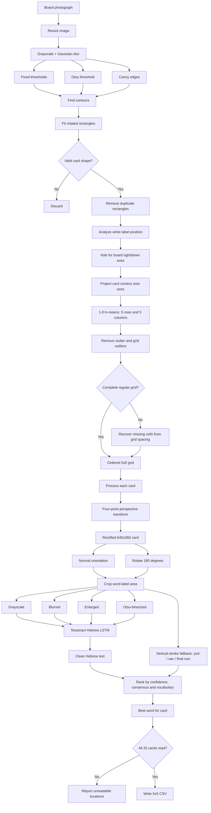
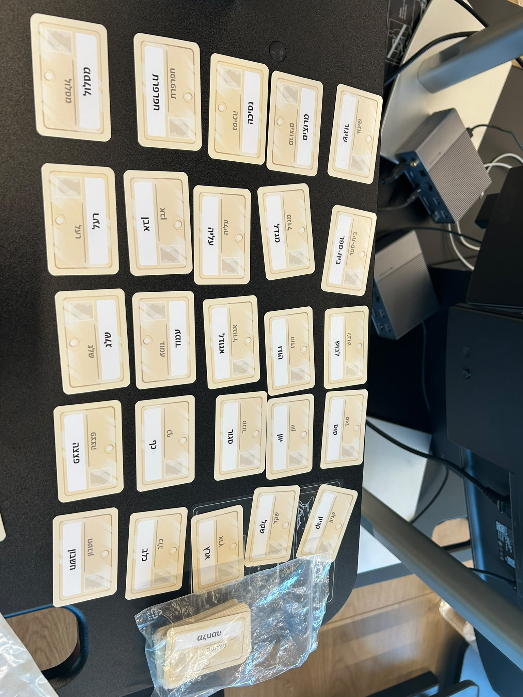
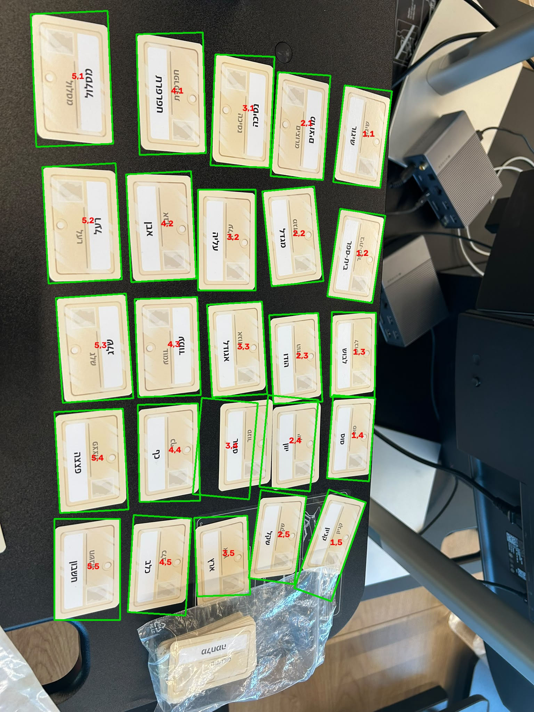

# Board reader flow

```mermaid
flowchart TD
    A[Board photograph] --> B[Resize image]
    B --> C[Grayscale + Gaussian blur]

    C --> D1[Fixed thresholds]
    C --> D2[Otsu threshold]
    C --> D3[Canny edges]

    D1 --> E[Find contours]
    D2 --> E
    D3 --> E

    E --> F[Fit rotated rectangles]
    F --> G{Valid card shape?}
    G -- No --> X[Discard]
    G -- Yes --> H[Remove duplicate rectangles]

    H --> I[Analyze white label position]
    I --> J[Vote for board right/down axes]
    J --> K[Project card centers onto axes]
    K --> L[1-D k-means: 5 rows and 5 columns]
    L --> M[Remove clutter and grid outliers]

    M --> N{Complete regular grid?}
    N -- No --> O[Recover missing cells from grid spacing]
    N -- Yes --> P[Ordered 5x5 grid]
    O --> P

    P --> Q[Process each card]
    Q --> R[Four-point perspective transform]
    R --> S[Rectified 640x360 card]

    S --> T1[Normal orientation]
    S --> T2[Rotate 180 degrees]
    T1 --> U[Crop word-label area]
    T2 --> U

    U --> V1[Grayscale]
    U --> V2[Blurred]
    U --> V3[Enlarged]
    U --> V4[Otsu-binarized]

    V1 --> W[Tesseract Hebrew LSTM]
    V2 --> W
    V3 --> W
    V4 --> W
    U --> Y[Vertical-stroke fallback: yod / vav / final nun]

    W --> Z[Clean Hebrew text]
    Z --> AA[Rank by confidence, consensus and vocabulary]
    Y --> AA
    AA --> AB[Best word for card]
    AB --> AC{All 25 cards read?}
    AC -- No --> AD[Report unreadable locations]
    AC -- Yes --> AE[Write 5x5 CSV]
```

## Example input

## Detected grid

## Recognized board

[Download the recognized 5x5 CSV](board.csv)
